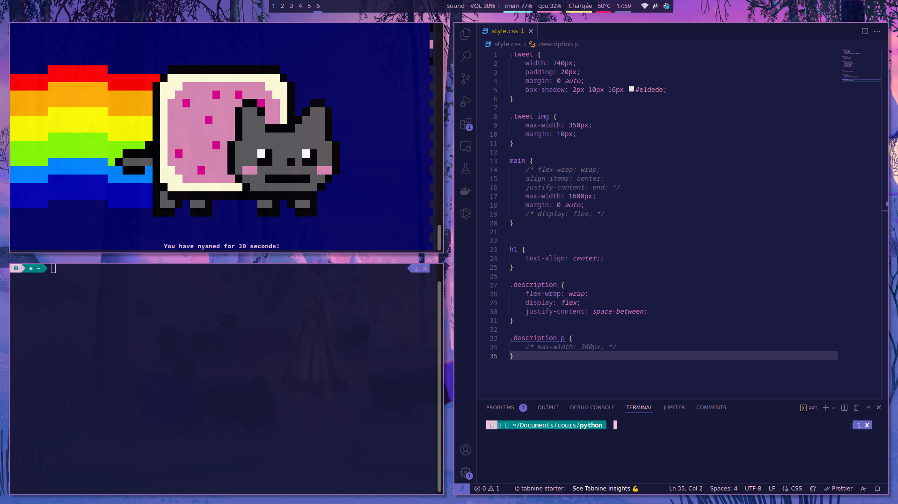
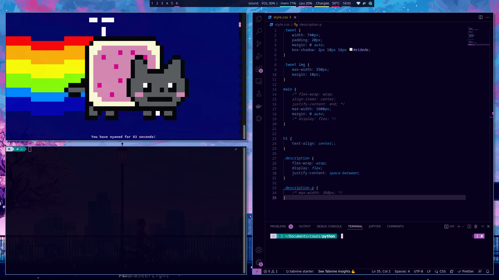
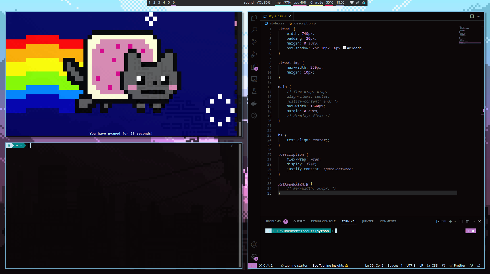

# .dotfiles

### I use this config with `manjaro i3`





<br/>

Add this folder to `~/`
Then make some symbolic links :

```
ln ~/.dotfiles/.config/dunst/dunstrc ~/.config/dunst/dunstrc
ln ~/.dotfiles/.config/i3/config ~/.config/i3/config
ln ~/.dotfiles/.config/polybar/config ~/.config/polybar/config
ln ~/.dotfiles/.config/polybar/launch.sh ~/.config/polybar/launch.sh
```

## Packages I use

```
sudo pacman -S dunst polybar rofi gnome-terminal pavucontrol feh
```

other optional packages I use :

```
code-insiders flameshot lxappearance nautilus btop
```

## i3 config

I use config-init from [flungo](https://github.com/flungo/i3-config.d)

### background :

you can change this line

`exec --no-startup-id feh --bg-scale '~/Pictures/Wallpapers/w0.jpg'` from `./i3/config.d/10-style.conf`
